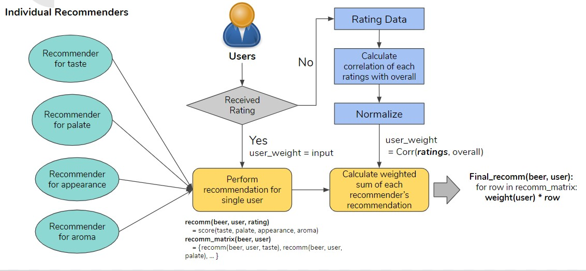
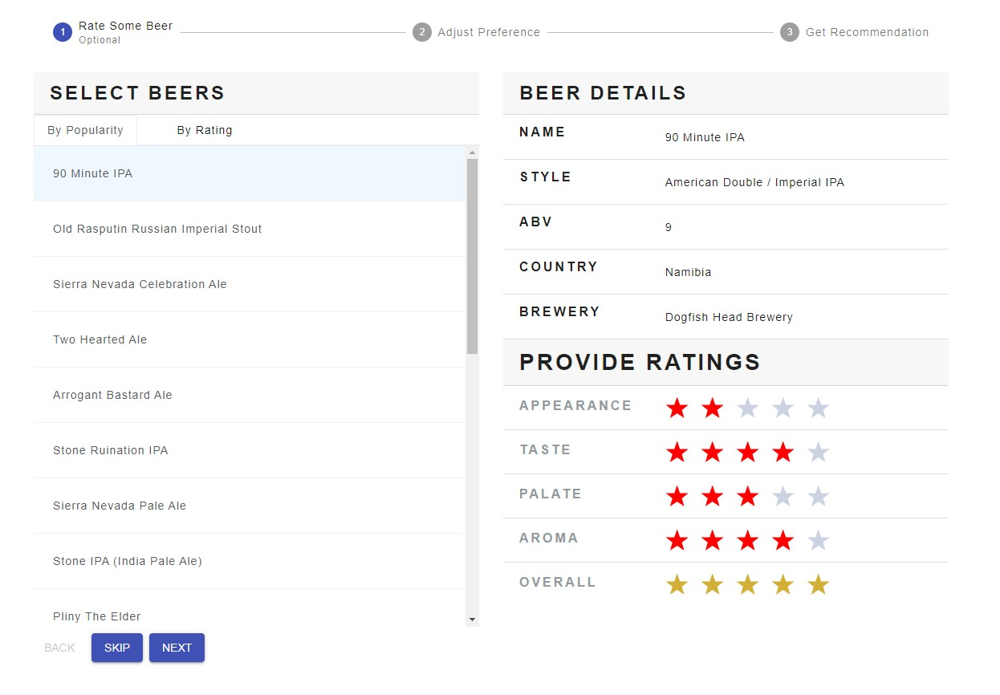
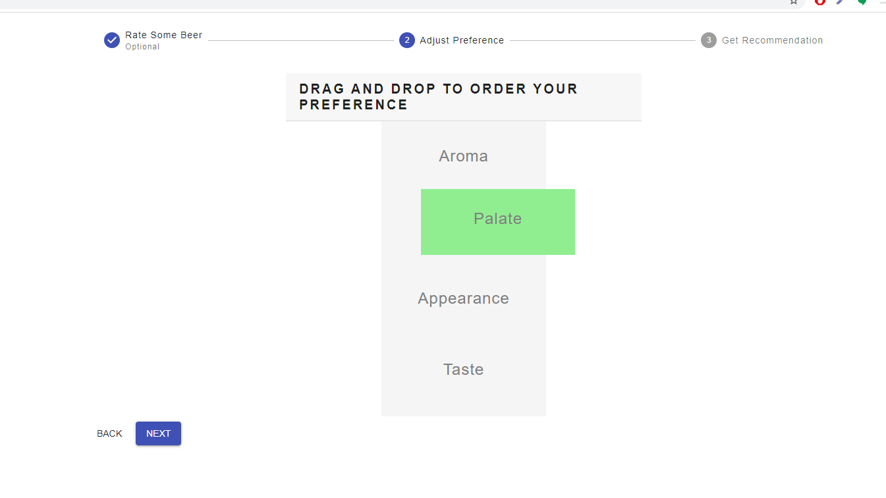
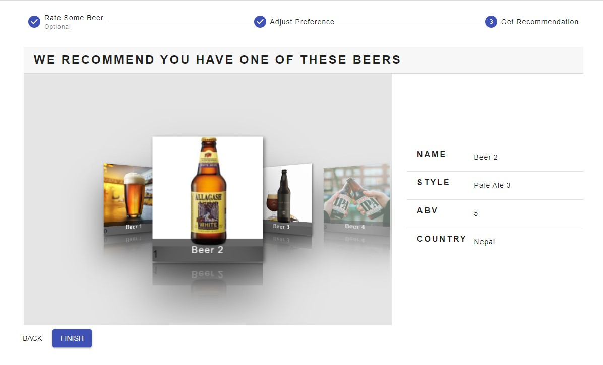

# personalized_multi_rating_beer_recommender_system

This project is a recommender system that recommends a new beer a user might like.

## Dataset

- https://www.kaggle.com/rdoume/beerreviews
- 1.5 million reviews
- 66,055 unique beers
- 33,388 unique users
- ratings on 4 different beer attribute: taste, appearance, palate and aroma
- 1 overall rating

## Problem

- When two or more users give a similar 'overall' rating for same kind of beers but different ratings for individual beer attribute
- For example, Beer 1 might have received an overall rating of 4 from User 1 and User 2 but it might have received totally different ratings of the beer's attributes
- In such cases, a recommender system based only on overall rating cannot figure out the user's actual preference

## Solution

- To create a recommender system that aggregates the result of 4 single-rating recommender system based on each of the beer attributes and their weighted average.
- The weight average can either come explicity from the user or by observing the correlation of each rating with the 'overall' rating.

## Python libraries used

- scikit-surprise

## Web Application

- A 3 step application to get your recommended beer
- Made using ReactJS

### Step 1: Browse and rate some beers

### Step 2: Order your preference of beer attribute

### Step 3: Browser through the recommended beers

# Project info

This project was part of a project for a course called Data Mining at KTH Royal Institute of Technology. It was done together with Heeje Lee (https://github.com/zedshape), Balint Kovacs and Yu-wen Huang.
